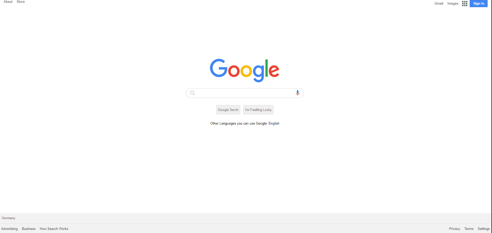

# Google Landing Page

## Description
Project aims to create google landing page.

## Problem Statement

- Your company has recently started on a project that aims to create a landing page. So you and your colleagues have started to work on the project.

## Project Skeleton 

```
003-google-landing-page (folder)
|
|----readme.md                
|----images            )   
        |----appicon.png   
        |----gfavicon.png
	|----google_microphone.png
	|----googlelogo.png
	|----icon-menu.jpg
	|----magnifying_glass.png
|----solution
        |----index.html  
        |----style.css   
        |----images
```

## Expected Outcome


<p align="center">
<a href="https://gulsen06.github.io/Google--landin/"></a>
</p>


### At the end of the project, following topics are to be covered;

- HTML 

- List Properties-Tables / CSS-The Display Property-The position Property

- Overflow Property-The float Property-Opacity / Transparency-Units in CSS

- CSS Setting height and width-CSS Outline-CSS Combinators


>>Part-1 HTML Structure

	- Creat structure of the HTML5
	- Give name of your project (title)
	- Create the main structure of the header (nav class="header-left)
	- Create the main structure of the header (nav class="header-right)
	- Create serachbar (div class="searchbar")
	- Create footer 

>>Part-2 CSS Structure

	- Set a background and define font-color="white"
	- Set container background color and margin
	- Define others color-size-padding etc...


